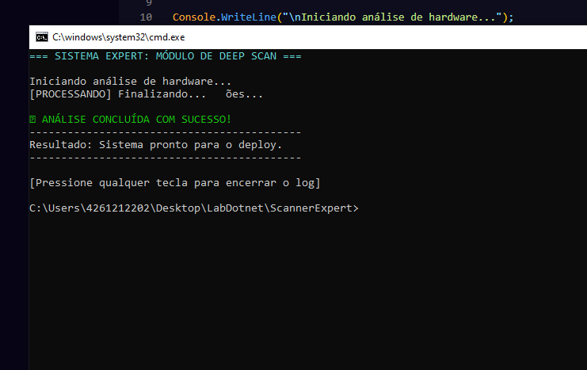

# 📊 Sistema Expert – Deep Scan

Este projeto simula um módulo de análise de hardware em ambiente de console, com foco em princípios de Interação Humano-Computador (IHC).

## 🎯 Heurística Aplicada

O sistema foi desenvolvido com base na **1ª Heurística de Nielsen: Visibilidade do Status do Sistema**.

> O sistema deve sempre manter o usuário informado sobre o que está acontecendo, fornecendo feedback adequado em tempo razoável.

---

## 💡 Como a Heurística foi aplicada

Durante a execução, o sistema fornece feedback contínuo ao usuário sobre o progresso da análise:

- Exibição clara do início do processo:
  `Iniciando análise de hardware...`

- Atualização dinâmica do status:
  `[PROCESSANDO] Verificando CPU...`
  `[PROCESSANDO] Lendo Memória RAM...`
  `[PROCESSANDO] Sincronizando SDK...`
  `[PROCESSANDO] Validando Permissões...`
  `[PROCESSANDO] Finalizando...`

- Uso do `\r` para atualizar a mesma linha, evitando poluição visual e mantendo o foco do usuário.

- Simulação de tempo real com `Thread.Sleep`, criando percepção de processamento.

---

## 🖥️ Evidência Visual

A interface apresenta:

- Título destacado em cor diferente (ciano)
- Status em tempo real
- Mensagem final de sucesso em verde

Durante a execução, é possível observar:

- ✔️ Indicação clara de progresso  
- ✔️ Feedback contínuo  
- ✔️ Atualização em tempo real  
- ✔️ Clareza no estado atual do sistema  

---

## ✅ Resultado

Ao final do processo, o sistema informa claramente o estado final:

`✅ ANÁLISE CONCLUÍDA COM SUCESSO!`
`-------------------------------------------`
`Resultado: Sistema pronto para o deploy.`
`-------------------------------------------`

Além disso, solicita uma ação do usuário:

`[Pressione qualquer tecla para encerrar o log]`

---

## 🧠 Conclusão

O projeto demonstra a aplicação prática da heurística de Nielsen ao:

- Reduzir a incerteza do usuário  
- Melhorar a experiência com feedback constante  
- Tornar o sistema mais transparente e previsível  

Assim, o sistema cumpre efetivamente a heurística de **Visibilidade do Status do Sistema**, garantindo que o usuário esteja sempre ciente do que está acontecendo durante a execução.
